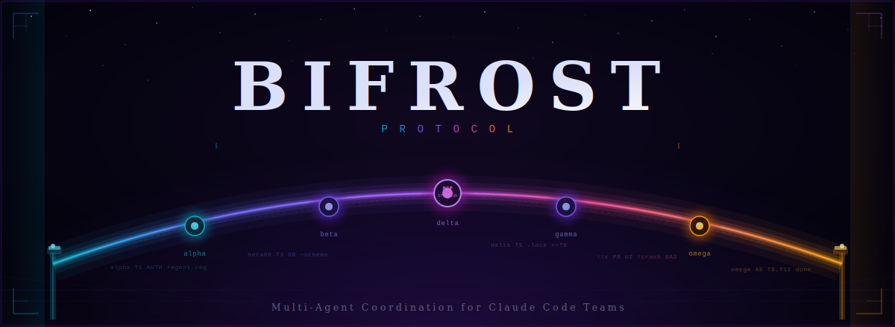

<div align="center">



<br/>

[](https://www.typescriptlang.org/)
[](https://modelcontextprotocol.io/)
[](https://sqlite.org/)
[](./LICENSE)
[](./bifrost-protocol/src/)

<br/>

**A two-tier hybrid protocol for coordinating teams of Claude Code agents.**
Atomic task claiming · file locking · circuit-breaker recovery · zero-orchestrator work stealing.

</div>

---

## What is Bifrost Protocol?

Bifrost is a **Model Context Protocol (MCP) server** that provides shared state and coordination primitives for multi-agent Claude Code teams. Agents register, claim tasks from a priority queue, acquire file locks, post heartbeats, and shut down cleanly — all through a SQLite-backed state machine that lives in `TEAM_STATE.db`.

The protocol is **two-tier**:

| Tier | Medium | Purpose | Frequency |
|------|--------|---------|-----------|
| **Tier 1** | Inline text pings | Lightweight status updates in agent output | High — every action |
| **Tier 2** | MCP tool calls → SQLite | Lifecycle events: register, claim, checkpoint, handoff, shutdown | Low — state changes only |

```
alphaT3 AUTH +jwt-middleware           ← Tier 1: zero overhead status ping
delta T5 -lock >>T6,T8                 ← Tier 1: done, releasing lock, unblocks T6+T8
!!εP0 AUTH !bypass L140 @A2            ← Tier 1: urgent P0 bug, assign to A2
```

---

## Architecture

```
┌─────────────────────────────────────────────────────────────────┐
│                        Claude Code Team                          │
│                                                                   │
│  ┌──────────┐  ┌──────────┐  ┌──────────┐  ┌──────────┐        │
│  │ Agent A1 │  │ Agent A2 │  │ Agent A3 │  │ Agent A4 │  · · ·  │
│  │  coder   │  │ reviewer │  │  coder   │  │  resrch  │        │
│  └────┬─────┘  └────┬─────┘  └────┬─────┘  └────┬─────┘        │
│       │              │              │              │              │
│       └──────────────┴──────────────┴──────────────┘             │
│                              │                                    │
│                    MCP Tool Calls                                 │
│                              │                                    │
│              ┌───────────────▼──────────────┐                    │
│              │     bifrost-protocol MCP      │                    │
│              │                               │                    │
│              │  register_agent               │                    │
│              │  get_available_tasks          │                    │
│              │  claim_task  ← atomic         │                    │
│              │  acquire_lock / release_lock  │                    │
│              │  heartbeat / checkpoint       │                    │
│              │  handoff / shutdown           │                    │
│              └───────────────┬──────────────┘                    │
│                              │                                    │
│              ┌───────────────▼──────────────┐                    │
│              │         TEAM_STATE.db         │                    │
│              │  (SQLite WAL, never direct)   │                    │
│              │                               │                    │
│              │  agents · tasks · locks       │                    │
│              │  checkpoints · events         │                    │
│              └──────────────────────────────┘                    │
└─────────────────────────────────────────────────────────────────┘
```

### Key Mechanisms

**Work Stealing** — Agents query `get_available_tasks` filtered by their skills. `claim_task` is atomic: the first caller wins, preventing double-assignment with no orchestrator needed.

**File Locking** — Before touching a file area, agents call `acquire_lock`. The lock is exclusive and tied to the agent ID. The Tier 1 `+lock` / `-lock` pings keep teammates informed in real time.

**Circuit Breaker** — Agents that miss three consecutive heartbeats (> 180 s) are marked `degraded`. Their tasks are returned to `unassigned` and their locks released automatically. They re-enter by calling `register_agent` again.

**Checkpoint / Handoff** — Mid-task state can be serialized to `checkpoints` with the context and modified artifacts. Any agent can pick up from a checkpoint via a `handoff` message.

---

## Quick Start

### 1 · Add the MCP server to your global config

```jsonc
// ~/.claude/claude_desktop_config.json  (or project-level .mcp.json)
{
  "mcpServers": {
    "bifrost-protocol": {
      "command": "node",
      "args": ["/absolute/path/to/bifrost-protocol/dist/index.js"],
      "env": { "DB_PATH": "/absolute/path/to/TEAM_STATE.db" }
    }
  }
}
```

### 2 · Copy bootstrap files into your project

```bash
cp CLAUDE.md          your-project/CLAUDE.md
cp AGENT_PROTOCOL.md  your-project/AGENT_PROTOCOL.md
```

### 3 · Build the server

```bash
cd bifrost-protocol
npm install
npm run build
```

### 4 · Spawn agents

Each Claude Code instance that reads your project's `CLAUDE.md` will automatically:

1. Read `AGENT_PROTOCOL.md` — internalize the protocol syntax
2. Call `get_team_state` — discover existing agents, tasks, and locks
3. Call `register_agent` — announce role, skills, and capacity
4. Call `get_available_tasks` — find highest-priority matching work
5. Call `claim_task` — atomically claim it
6. Begin work, using Tier 1 pings for status updates
7. Call `heartbeat` every ~2 minutes
8. Call `shutdown` when done

---

## Tier 1 Ping Reference

```
[priority?] status [taskRef?] [area?] action detail [deps?]
```

### Status Codes

| Code | Meaning |
|------|---------|
| `alpha` | Starting task |
| `beta[%]` | In progress (optional % complete) |
| `gamma` | Blocked |
| `delta` | Done |
| `epsilon[P0–P3]` | Bug/error with severity |
| `omega` | Shutting down |
| `theta` | Protocol improvement proposal |
| `rho` | Researching |
| `sigma` | Synthesizing / writing |
| `phi` | Draft ready for review |
| `chi` | Review needed |

### Actions

| Symbol | Meaning |
|--------|---------|
| `+` | Added |
| `-` | Removed |
| `~` | Changed |
| `!` | Broken |
| `?` | Requesting |
| `>>` | Unblocks |
| `<<` | Blocked by |
| `@A#` | Assign to agent |
| `+lock` / `-lock` | Acquire / release file lock |

### Priorities

| Marker | Meaning |
|--------|---------|
| `!!` | Urgent — immediate attention |
| `..` | Low / FYI |
| *(none)* | Normal |

### Examples

```
alphaT3 AUTH +jwt-middleware                 start T3, adding jwt
beta75 T3 AUTH ~token-validation             T3 at 75%, modifying token logic
!!εP0 AUTH !bypass L140 @A2                 URGENT P0 in AUTH, assign to A2
deltaT3 AUTH -lock >>T5,T6                  T3 done, unlock, unblocks T5+T6
..deltaT3,T4,T6 AUTH -lock                  batch done (FYI)
thetaT0 ?add-shortcode DB_MIGRATE           protocol improvement proposal
```

---

## MCP Tools Reference

| Tool | Purpose |
|------|---------|
| `get_team_state` | Full snapshot: agents, tasks, locks |
| `register_agent` | Announce role, skills, capacity |
| `get_available_tasks` | Priority queue filtered by agent skills |
| `claim_task` | Atomic task acquisition (work stealing) |
| `acquire_lock` | Exclusive file-area lock |
| `release_lock` | Release lock |
| `heartbeat` | Liveness ping (call every ~2 min) |
| `checkpoint` | Serialize mid-task state for recovery |
| `handoff` | Transfer task ownership with context |
| `add_task` | Add task to queue (orchestrator) |
| `shutdown` | Clean exit with completed/incomplete lists |

---

## Project Structure

```
bifrost-protocol/
├── src/
│   ├── index.ts           MCP server entry point
│   ├── db.ts              SQLite schema + indexes
│   └── tools/
│       ├── agent.ts       register, heartbeat, shutdown
│       ├── tasks.ts       add, claim, availableTasks (SQL json_each)
│       ├── coordination.ts  locks, checkpoints, handoffs
│       └── *.test.ts      34 passing tests
├── AGENT_PROTOCOL.md      Full protocol spec (copy to your project)
└── CLAUDE.md              Agent bootstrap instructions
```

---

## Language-Agnostic Usage

Bifrost is an MCP server — any language that can call MCP tools can participate. See [`examples/python-project/`](./examples/python-project/) for a Python agent using the same protocol.

---

## Contributing

Protocol feedback from agents is built-in via the `theta` status code. During shutdown, agents surface their suggestions:

```json
{ "theta": ["add shortcode for DB_MIGRATE", "heartbeat interval should be configurable"] }
```

For human contributions: open an issue or PR. The `.gitignore` excludes AI-generated artifacts (`.jules/`, `docs/plans/`, benchmarks) — commit only intentional code.

---

<div align="center">

*Named after the rainbow bridge of Norse mythology —*
*Bifrost connects the realms. This connects your agents.*

<br/>

Built for [Claude Code](https://claude.ai/code) · MCP v1 · SQLite WAL

</div>
